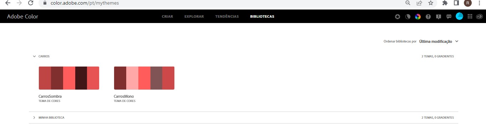

# Projeto em grupo
Integrantes:
Lucas Magalhães Pacheco
Nicole Prim a mais linda
Raquel Baptista Burger

## Empresa Escolhida
4Cars 

## Link surge
<http://alves-4cars.surge.sh>

Utilizamos o arquivo CNAME para atualização do dominio personalizado

## Informações-Gerais
Em nosso projeto optamos por dividir a Landing page em 3 partes, sendo: Home, Planos e Perguntas frequentes.
Utilizamos como cores bases a paleta de cores monocromática gerada através da roda de cores do site da Adobe, usando como cor base a cor da logo da 4Cars.
Usamos como inspirações a pesquisa em diversos sites de locadoras de veículos para motoristas de aplicativo e também uso pessoal.

## Distribuição de tarefas

Utilizando como apoio o quadra Kaban através do site Trello, dividimos as tarefas da seguinte maneira:
*Lucas - Responsável pela Home
*Nicole - Responsável pelo Perguntas Frequentes
*Raquel - Responsável pelo Planos

Respeitando as dificuldades e aptidões de cada, todos ajudaram em todas as páginas, conseguimos nos organizar bem como equipe de trabalho e gostamos muito do resultado final apresentado.
